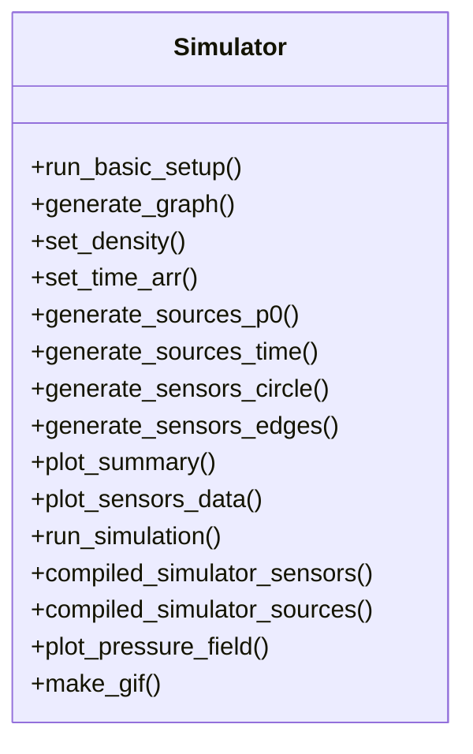

<h3 align="center"> Complex acoustic wave propagation modeling through heterogeneous medium with structural discontinuities </h3>
<hr>

The Acoustic Data Modeling Project provides a codebase to generate different types of complex heteregenous physical medium and allow to do aocustic wave progpagation modeling that can help investigate how an elastic waves behaves through a medium. This type of analysis inform researchers on how to assess the property of a medium through inverse modeling. This package contains diverse set of utility warppers to help generate any type of medium as user deems through different graph processing or geospatial covariace modeling. The framework provides the flexibility to investigate the propagation of any energy pulses—whether Gaussian-enveloped wavelets or pressure perturbations—through the medium, enabling analysis of wave–medium interactions under varying physical conditions. The architecture also allows users to deploy sensors across the medium as needed to analyze the recorded pulse. In summary, the package serves as a virtual computational laboratory for fluid mechanics, allowing users to synthetically construct media, simulate wave propagation through these media, record resulting signals, and generate physically informed simulations for analysis and experimentation. <br> <br>


## Project Tree
The following project tree contains the summarized information about the about how the project is architected and information regarding the notebooks and their usage.

```
📦 PRJ_ACOUSTIC_DATA_MODELING
├─ readme.md 
├─ requirements.txt (divided in two sections with \n\n. The first section contains the list of libraries particularly needed for this package. The second section is optional helpful other python libraries)
├─ src
│  ├─ example notebooks (jupyter notebooks to show how particular tasks can be performed)
│  │  └─ generate_waveform_model.ipynb (code examples on how to generate different types of mediums, reflection patterns and simulations)
│  │  └─ wave_popgation_demo.ipynb (this notebook demonstrates how different parameters contributes to time pulses are generations and their usage guidelines)
│  ├─ utils (all useful functions)
│  │  └─ waveform_models.py (Class related to the modeling. Each component of the class is discussed in detail in a later section of this document)
│  └─ test_notebooks (contains notebooks for development and testing purposes)
│     └─test_waveform_models.ipynb (testing different types of field generations) 
└─ data
   ├─ summary_plots (saves two different types of plots. One is plot related to the medium sensor locations and initial wave speed. The other is recorded waveforms at different time steps at the sensors) 
   │  ├─ graph (summary plots for binary medium modeled through graphs)
   │  └─ spatial  (summary plots for continuous medium modeled through covariance structure)
   ├─ wave_propagation_plot (saves the gifs of waveform simulations through a medium)
   └─ waveforms (holds hdf5 files containing recorded waveforms at the sensors that passed through a modeled media, for all time steps)
      ├─ graph (reflection and resonance pattern for graph type binary fields)
      └─ spatial (reflection and resonance pattern for spatially correlated continuous fields)
```

&nbsp;

## Brief Description of Utility Functions
The utility functions folder contain a single python file with one class defined in it. The class is called "Simulator" and contains all the necessary methods for modeling and simulation purposes. The pricciple behind the workflow is that first a medium or field eeds to be defined along with information such as wavespeed and medium density. Then a location of a type of stiumation must be defined. Optinally receivers needs to be placed on the surface and then the simulation can be run to observe the forward process. This section carefully defines the functions and their parameters and how they can be used with example for reference. 

To start, all the important public methods has been outlined below:


<br>

## Basic Example of How to Run an Experiment
For an easy first order example run an user can instantiate the a simulator class with a domain description and then directy call this function to generate results. Following is an example code block with all default settings: <br>

```
domain = Domain((128*2+10, 128*2+10), (1, 1))
simulator = Simulator()
simulator.run_basic_setup()
simulator.compiled_simulator_sensors()
simulator.plot_sensors_data(sensors_data,vmax=0.3,vmin=-0.3,save_me=False)
```
 
<br>

### About Parent Class
The Simulator class has some standard parameters that an user would like to setup in general before proceeding to a more refined setup. The following table outlines the most important parameters for conducting an experiment.<br>


| **Std. Params** | | |   |
|-----------|-------------|-----------|-----------|
| Name  | Type     | Objective | Requriement |
| `domain`      | Domain   | defines the geometry of the medium, ((width x, height y), (resolution dx,resolution dy)). domain needs to be defined with Domain jwave class. The numbers can be continuous or discrete | Standard |
| `defect_density`    | int   | defines the speed of sound through the primary or base medium. Default is 3000 m/s  | Standard |
| `base_density`    | int   | defines the speed of sound through the secondary or damaged medium. Default is 1000 m/s   | Standard |
| `sound_speed` | float   | defines the reference speed of sound. This variable gets updated as per the constructed media. Default is 1500 m/s  | Standard |
| `density_rho`   | float   | defines the density settings of the media. This variable gets updated as per the constructed media. Default is 1 stating homegenous medium    | Standard |
| `air_speed_of_sound`   | float   | defines the reference speed of sound through the air. This is needed if an air layer is constructed around the medium to allow coda waves. Else the PML layer will absorve all reflections. Deafault is 343 m/s    | Standard |
| `num_air_grid`    | int   | number of pixels around the edges of the Domain to generate a air layer. This number, if defined, should be more than the pml size. This will ensure PML layer is placed on top of the air layer but around its edges. Default is 10  | Standard |
| `pml_size`    | int   | number of pixels for perfect matching layer (PML) to absorve the waves around the edges. If this is set to 0 then the waves leaving one side of the domain will reappear at the opposite side creating a messy result. If this layer size is set inappropriately, then  PML will absorbs some (but not all) of the waves approaching the boundaries, thus some of the wave wrapping will be visible. Default is 5 | Standard |

| **Add. Params** |   |   | |
|-----------|-------------|-----------|-----------|
| Name  | Type     | Objective | Requriement |
| `path`      | string   | defines the path where the calculated waveforms and summary plots need to be saved. Deafult is Empty string. | Standard |
| `set_sound_flag`      | boolean   | set to true if the assmuption is that medium is homeogenous and sound speed is varying. Default is True. | Standard |
| `set_density_flag`      | boolean   | set to true if the assmuption is that medium is heterogenous and sound speed is constant. Default is False. | Standard |
| `graph_type`      | string   | sets the type of network graph to generate the medium. The options to choose from are *'erdos_renyi_graph','random', 'scale_free','small_world','ER', 'spatial', 'spatialWS', 'blocks_assortative', 'overlapping_communities', 'nestedness', 'maximal_stars', 'core_distance', 'fractal_leaves', 'fractal_root', 'fractal_hierarchy', 'fractal_star', 'perlin_noise', 'disconnected_cliques'*. For spatial correlation type mediums the options to choose from are | When medium is constrcuted with a graph |
| `p_vals`      | float   | defines the probability of node connectivety.  The higher this value the more nodes are connected indicating stronger discontinuty in the meidum.Range is 0-1. Default is 0.1 | When medium is constrcuted with a graph |
| `epsilon`      | float   | controls the "randomness" or deviation from the ideal structure of the specified graph type. A value of 0 corresponds to a deterministic structure,  while 1 corresponds to a fully random network. Range is 0-1. Default is 0.5 | When medium is constrcuted with a graph |
| `cov_model_name`      | string   | sets the name of the covariance model used to generate a continuous spatially correlated medium. The options to choose from are *'Gaussian','Exponential','Matern','Spherical','Circular','Linear','Stable'*. Default is 'Gaussian' | When medium is constrcuted with spatial option |
| `cov_model_dim`      | float   | sets dimension of the covariance strucutre. User needs to decide if spatial correlation is unidirectional of bidrectional. Default is 2. | When medium is constrcuted with spatial option |
| `cov_model_var`      | float   | sets the variance of the covariance model. Default is 1.  | When medium is constrcuted with spatial option |
| `cov_model_angles`      | float   | sets the angle for anisotorpy of the medium. Defualt is np.pi. | When medium is constrcuted with spatial option |
| `cov_model_len_scale`      | float   | sets the range of variogram. The higher this valeu the more smooth meidum will be. Default is 15.| When medium is constrcuted with spatial option |
| `cov_model_transform_field` | boolean   | for additional transformation to the sptailly correalted medium such as Boolean, LogNormal etc. this option can be set to true. Default is False | When medium is constrcuted with spatial option |

References:
* Find more about Covariance Model details here : https://geostat-framework.readthedocs.io/projects/gstools/en/stable/examples/02_cov_model/index.html <br>
* Find more about Graph Strucutres here: https://structify-net.readthedocs.io/en/latest/Tutorial/Tutorial.html; https://app.readthedocs.org/projects/chebee7i-networkx/downloads/pdf/docdraft/ <br>
* Find more about Perfect Matching Layers here: http://www.k-wave.org/documentation/example_na_controlling_the_pml.php <br>

&nbsp;

### About Code Entry Point 
<b>run_basic_setup():</b> This is the entry point of the code, a public method which puts all the building blocs together to process the waveform popagation model. By default, the program runs for a graph type medium generated with 'fractal_noise' type adjacency matrix with only 10% discontinuties (p_vals=0.1) in the medium and produce a pressure pulse to proagate through the medium which are recorded across sensors surrounding the edge of the medium. Now the run_basic_setup() function contains number of arguments which users can tweak to set up an experiments as per individual requirements. The most important parameters has been defined below:

| **Std. Params** | |   |
|-----------|-------------|-----------|
| Name  | Type     | Objective | Requriement |
| `field_type`  | string   | defines the method needs to be used to construct the medium. Can be either 'Grpah' or 'Spatial' | Standard |
| `use_p0`      | boolean   | defines the stimulant, if needs to be a pressure field our gaussian time pulse | Standard |
| `circle`      | boolean   | defines if the sensor placement needs tobe circular fashion or rectangular | Standard |

| **Kwargs** | |    |   |
|-----------|-------------|-----------|-----------|
| Name  | Type     | Objective | Requriement |
| `add_sensor_at_source`      | boolean   | set this value to true if an adiditonal secondary sensor needs to be kept near the source other than the priary sensors. Default is False. | Standard |
| `plot_data`      | boolean   | set this value to true if one need to plot the graph of spatial strcuture separately. Default is False. | Standard |
| `transform_mode`    | list   | different transformations can be applied to the covariance models. The options are *'Binary','ZinnHarvey','LogNormal','ForceMoment'*. This field will only make sense when cov_model_transform_field variable is set to true. To make multiple trasnformation, pass multiple vailable options to the list. Default is Binary. | When medium is constrcuted with spatial option |
| `seed_val`    | int   | set this to any integer value for generating reproducible results for covarince model fields. Default is False | When medium is constrcuted with spatial option |
| `pressure_source_raddi`    | float   | This is the raddius of the pressure field. The higher the radius the stringer the stiimulant will be. Default is 6. | When stiumalant is pressure pulse |
| `pressurce_source_loc`    | tuple   | cartesian coordinates of the pressure source location. Default is (62,62) | When stiumalant is pressure pulse |
| `pulse_source_loc`    | tuple   | cartesian coordinates of the pressure source location. At least two time pulses needs to be provided. Both can be at the same location or different location. Default is ((62,62),(62,62)). | When stiumalant is gaussian time pulse  |
| `amp`    | float   | the amplitude of the gaussian time pulse type stimulant. The higher the value, stronger the pulses will be. Default is 1. |  When stiumalant is gaussian time pulse |
| `freq`    | float   | the frequency of the gaussian time pulse type stimulant. Check 'wave_propagation_demo' notebook in the example notebooks to determine how to decide the frequnecy. Default is 50 | When stiumalant is gaussian time pulse  |
| `pulse_sigma`    | float   | sets the variance of the gaussian pulse. It determine the width of the pulse. Default is 4e-2. | When stiumalant is gaussian time pulse  |
| `pulse_1_m`    | float   | sets the mean of the first gaussian pulse. It determine the location of the pulse on the time step axis. Smaller the value the more early the stimulant will be generated in the time stepping function. Check 'wave_propagation_demo' notebook in the example notebooks to determine how to decide the mean. Default is 0.08 | When stimulant is gaussian time pulse  |
| `pulse_2_m`    | float   | sets the mean of the second gaussian pulse. It determine the location of the pulse on the time step axis. Smaller the value the more early the stimulant will be generated in the time stepping function. Default is 0.52 | When stiumalant is gaussian time pulse  |
| `sensor_locations`    | list   | set this value with four different options such as *'top', 'right', 'bottom', 'left'*. These are the locations of the sensor receivers that can be placed on the medium to record the wave propagations. Default is ['top', 'right', 'bottom', 'left']. | When sensors are placed linearly around edge  |
| `circle_dim`    | tuple   | sets cartesian spread of the receiver sensors when distributed in a cicular fahsion around the medium. Default is (125,125). | When sensors are placed in a circular fashion |

References:
* Find more about Homogenous Medium here: https://ucl-bug.github.io/jwave/notebooks/ivp/homogeneous_medium.html <br>
* Find more about Heterogenous Medium here: https://ucl-bug.github.io/jwave/notebooks/ivp/heterogeneous_medium.html <br>
* Find more about Point Source here: https://ucl-bug.github.io/jwave/notebooks/time_varying/point_sources.html <br>

&nbsp;

## Detailed Description of How to Run an Experiment
1) First a Doamin Needs to be declared as follows:
```
domain = Domain((128*2+10, 128*2+10), (1, 1))
```
2) Next, adjust the required parameters to set up the Medium and the type of Stimulant. For example the below code sets up a Medium with Graph constructors. It defines the graph to contain Perlin Noise adjacenecy. The probability of number of edges is deifned as 0.1 i.e. 10% damage in the medium. The code defines an air layer and a PML layer of given size. The air layer allows reflections of the wave from the edges to obtain coda details through the meidum. The base_density and defect_density is defined as the speed of sound through the base and damaged medium. 
```
simulator = Simulator(domain,pml_size=10,num_air_grid=20,base_density=3000,defect_density=1000)
simulator.graph_type = 'perlin_noise'
simulator.path = '/home/urseismoadmin/Documents/PRJ_ACOUSTIC_DATA_MODELING/data/summary_plots'
simulator.p_vals = 0.1
```

3) Next the run_basic_setup method is called with additional arguments. The use_p0 has been set to false to indicate that a gaussian time pulse stimulant is needed rather than a pressure stimulant. Additionaly the pulse amplitude value and location value has been explicitly defined. The pulse mean values are also adjusted to have different arrivals.
The sensor location has been set to ['bottom','right'] as a linear placement at the bootm and the right edge of the medium. The sensor arragements are not circular since circle parameter is by default false. The add_sensor_at_source has been set to true to indicate an adiditonal sensor is placed near the stimulant source. This often helps later during inversion process to know about the source wave properties. 
```
simulator.run_basic_setup(sensor_locations=['bottom','right'], add_sensor_at_source=True, use_p0=False, amp=5, pulse_source_loc = ((62,62),(62,32)), 
                            pulse_1_m = .2, pulse_2_m=.52)
```
4) Finally compiled_simulator_sources() method is called which will cause the stimulant source pulse to move through the medium and generate waveforms from the recorded signals at the recevier sensors. Please note, if using Pressure Pulse as a source then use compiled_simulator_sensors() method.
```
sensors_data = simulator.compiled_simulator_sources()
```
5) Optional step, where if no sensors are needed and only wave propgation simulation needs to be investigated then the following code can be executed. The code invokes the run_simulation() method with use_p0=False indicating gaussian time pulse as a source. It then plots the waveform state at a time step 5000.
```
pulse_propgation = simulator.run_simulation(use_p0=False)
t = 5000
show_field(pulse_propgation[t])
```
<hr>

&nbsp;

**Note:** 
* Many different type of examples can be found in the `generate_waveform_model.ipynb` notebook laced in the example_notebooks folder.
* An user can in principle call the generate function multiple times and add the field outputs into `self.G_grid_array`.

&nbsp;

**Additional Notes:**
* We are getting basically a reflection and resonance pattern in the Graph field - the attenuation in the calcs is very low (it’s unity by default I think), so damping isn’t too much. Might be good to include that as an explicit option for code (for spec master, the default is ok but maybe good to change for other cases down the line as needed) 
* User can change desinity of the medium, by default is 1
* For now the code assumes that either the Medium is homeogenous and Sound speed is varying, OR the meidum is heteregenous and Sound Speed is constant. The code can easily be updated to allow both but that funtionality has not been provided.
* Stating the above point, it must be notest that keeping the sound speed variant and desisity constant or vice versa can be appeared to be an inverse operation of each other but not exactly. The way PDEs are solved has important affects on the solutions and therefore velocity varions-density constant wave propagation solution will be different from the density variant-velcoity wave propagation constant solution. For more details regarding this please look inot the [K-Wave documentation](http://www.k-wave.org/manual/k-wave_user_manual_1.1.pdf), governing equations for both this scenarios. We can notice how the frist order dervative terms will change as the assumption changes and thus will result is different propagation pattern. 
* Therefore, for experiments with more complicated mediums where both density and elastic modulous vary,  it is suggested to use K-Wave package. For mediums like ocean water and hydroacoustic wvae propagation this is not a problem since the young modulous remains constant even though ocean water denisities will be varying.
* We have to update the attenutation function based on user input
* More variables can be adjusted for example number of sensors, attenutation etc. We will modify the code more to allow more felixibility.


#### Change Log
1. Updated the Make Gif Code
2. Updated the waveform_models.py to take G_Grid_array in the initalization of simulator class so that if this array is provided then new graph medium is not computed. In "generate_spatial_corr_field" and "generate_graph" function added the if logic to read if g_grod array is provided.
3.
